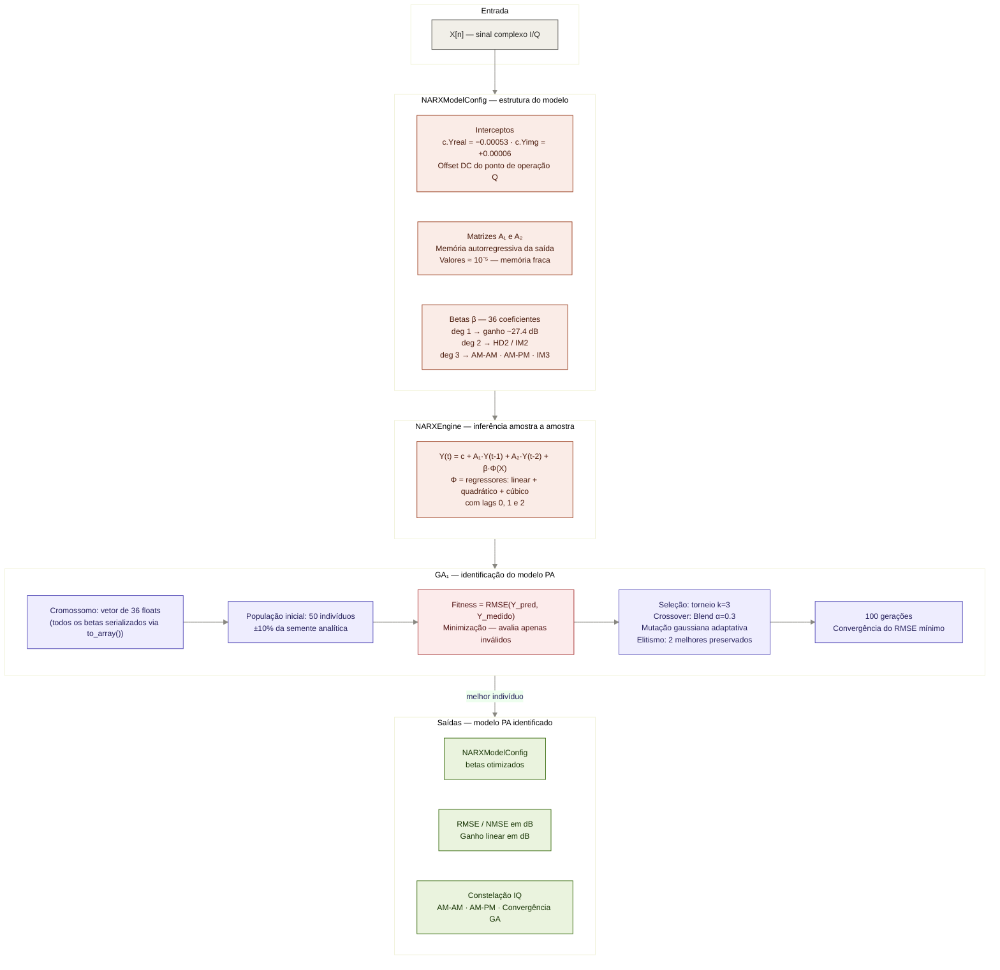
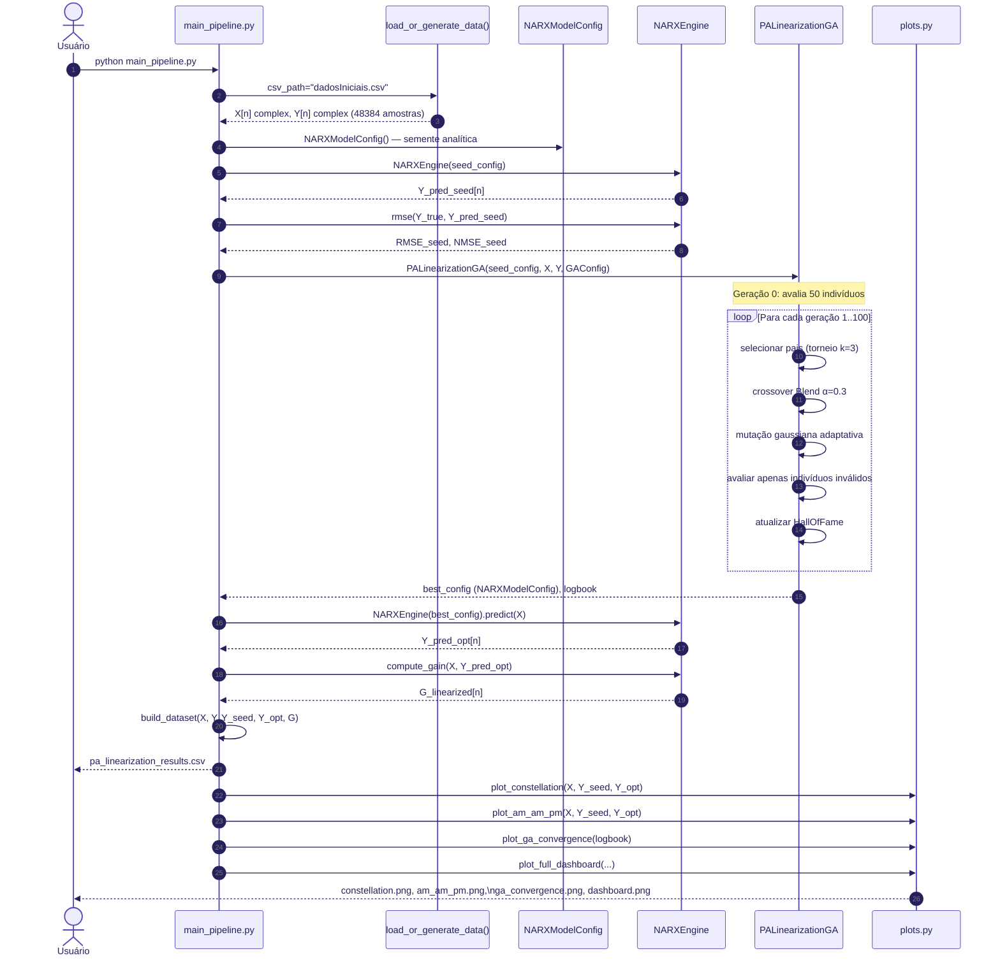
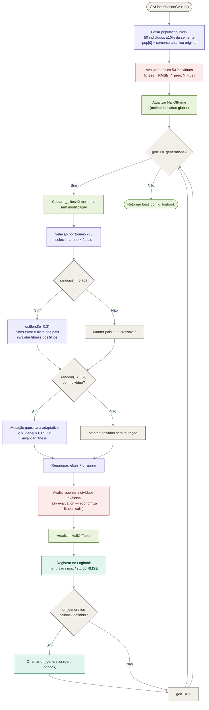
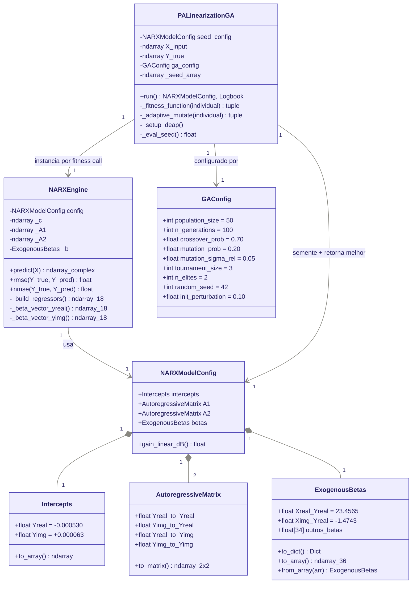
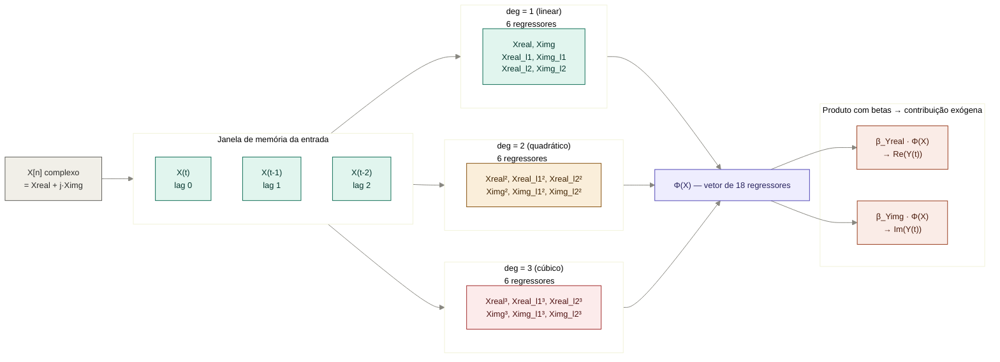

# Diagramas de Comportamento e Fluxo — Sessão 1

---

## Diagrama 1 — Arquitetura de Módulos (Estrutural)

---

## Diagrama 2 — Fluxo de Execução do Pipeline (Sequencial)

---

## Diagrama 3 — Loop Evolutivo Interno do GA (Fluxo de Controle)

---

## Diagrama 4 — Modelo de Dados e Relações entre Classes

---

## Diagrama 5 — Estrutura dos Regressores Φ(X)

