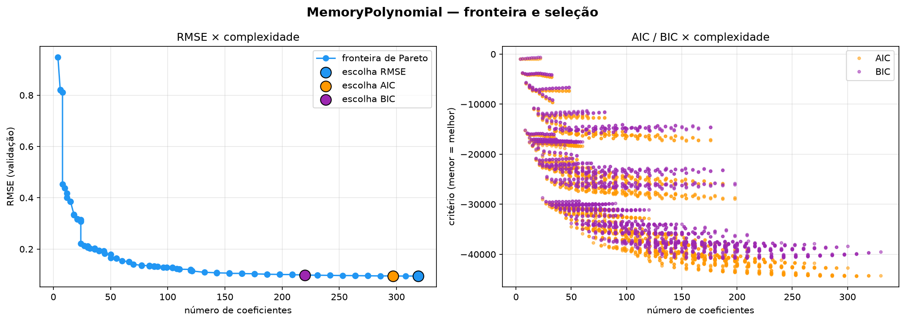
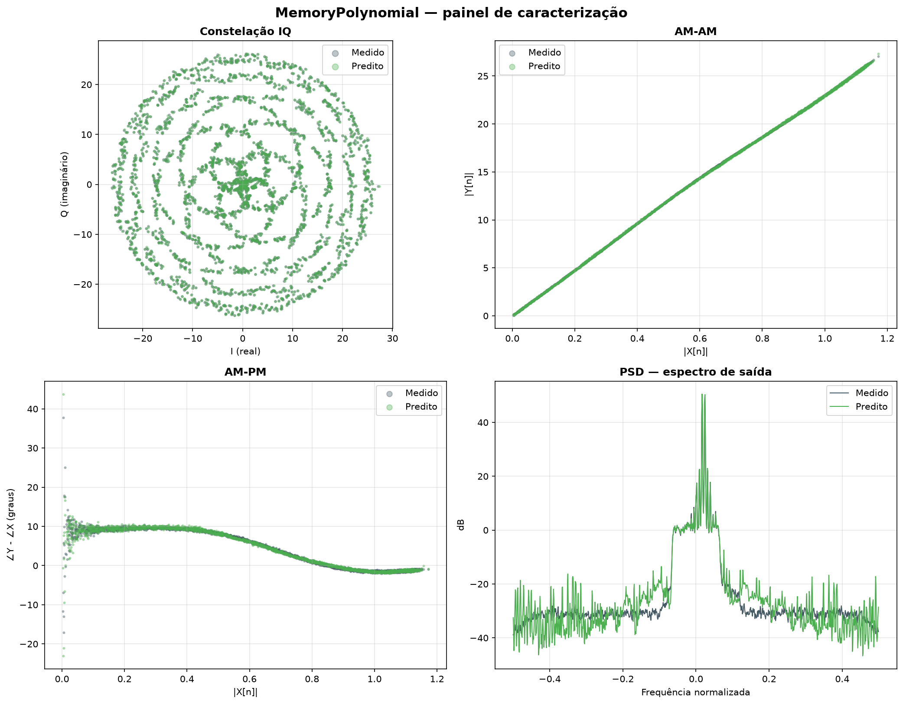

# Relatório de Caracterização de PA

*Gerado em 2026-07-24 13:45*  ·  fonte: `output/`

## 1. Comparação entre modelos

| Modelo | nº coef | RMSE | NMSE (dB) | EVM (%) | Ganho (dB) | Veredito EVM |
|---|---:|---:|---:|---:|---:|---|
| MemoryPolynomial | 220 | 0.0970 | -45.56 | 0.527 | 27.40 | EXCELENTE |

**Melhor por RMSE:** MemoryPolynomial (RMSE = 0.0970, EVM = 0.527%, 220 coeficientes).

## Modelo: MemoryPolynomial

- **Hiperparâmetros:** `{'memory': 10, 'r_deg': 10, 'i_deg': 10}`
- **Amostras (teste):** 9,667  ·  **PAPR da entrada:** 3.38 dB

### Métricas (padrão TELECOM)

| Métrica | Valor | Veredito |
|---|---:|---|
| RMSE | 0.09696 | — |
| NMSE | -45.56 dB | EXCELENTE |
| EVM | 0.527 % | EXCELENTE |
| Ganho médio | 27.40 dB | — |
| Planicidade de ganho (σ) | 0.251 dB | BOM |
| Planicidade de fase (σ) | 4.748 ° | A MELHORAR |

### Seleção de modelo (histórico do GridSearch)

O GridSearch avaliou **2250** combinações. Escolha por critério:

| Critério | nº coef | RMSE |
|---|---:|---:|
| RMSE | 319 | 0.0948 |
| AIC | 297 | 0.0949 |
| BIC | 220 | 0.0984 |



### Equação do modelo (12 termos dominantes)

```
  (+1.509e+05+5.394e+04j) · xr[n-4]*|xr[n-4]|^6
  (+1.414e+05+6.758e+04j) · xr[n-6]*|xr[n-6]|^6
  (-5.495e+04+1.342e+05j) · xi[n-4]*|xi[n-4]|^6
  (-6.47e+04+1.197e+05j) · xi[n-6]*|xi[n-6]|^6
  (-1.258e+05-4.096e+04j) · xr[n-4]*|xr[n-4]|^7
  (-1.184e+05-5.397e+04j) · xr[n-6]*|xr[n-6]|^7
  (+4.398e+04-1.066e+05j) · xi[n-4]*|xi[n-4]|^7
  (+5.355e+04-9.496e+04j) · xi[n-6]*|xi[n-6]|^7
  (-7.995e+04-2e+04j) · xr[n-4]*|xr[n-4]|^5
  (-7.484e+04-3.276e+04j) · xr[n-6]*|xr[n-6]|^5
  (-5.77e+04-5.672e+04j) · xr[n-5]*|xr[n-5]|^6
  (+5.809e+04+4.516e+04j) · xr[n-5]*|xr[n-5]|^7
```


