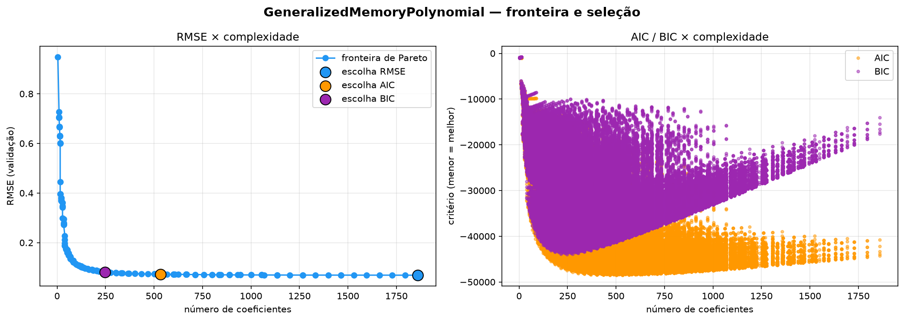
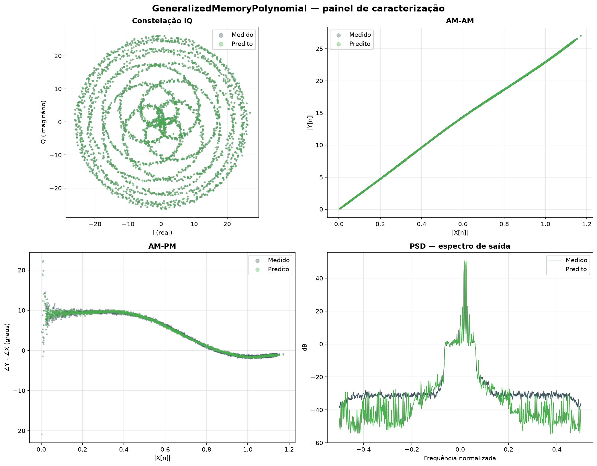
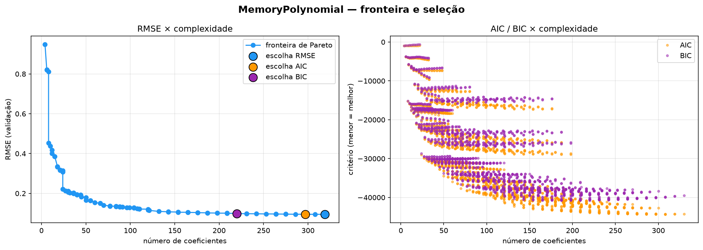
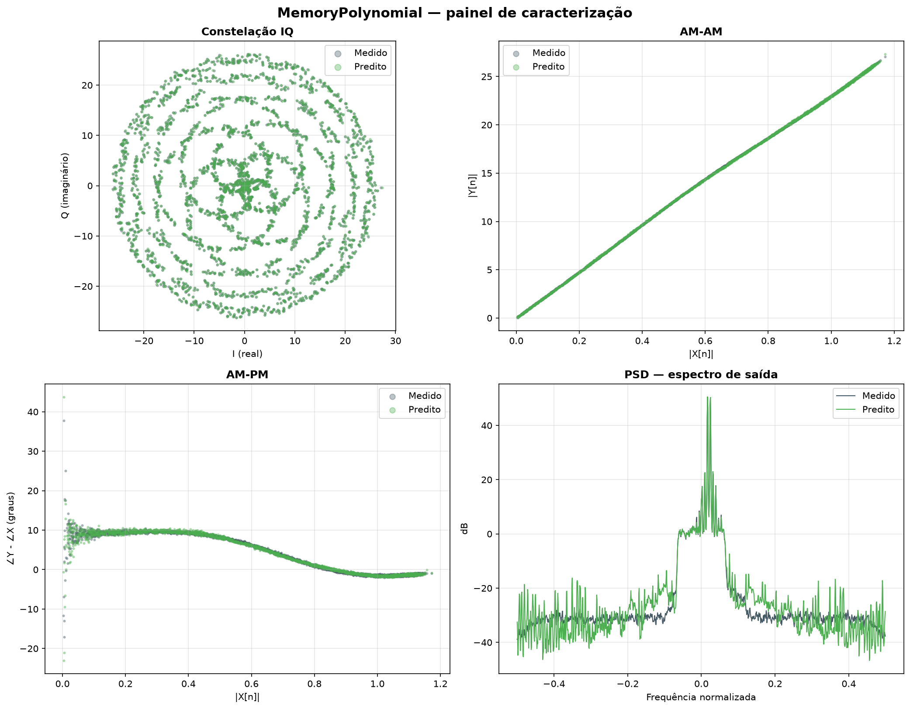
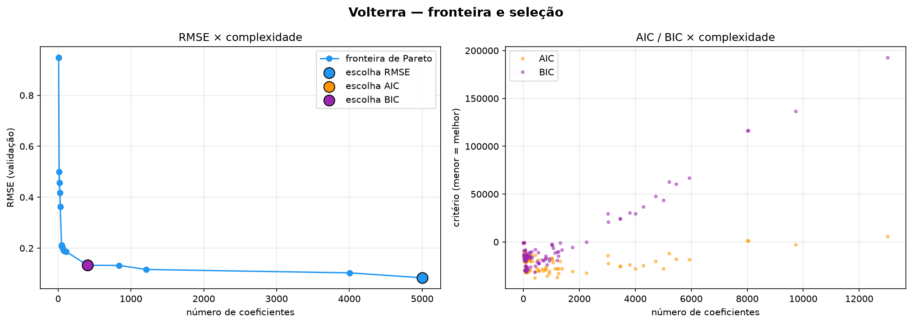
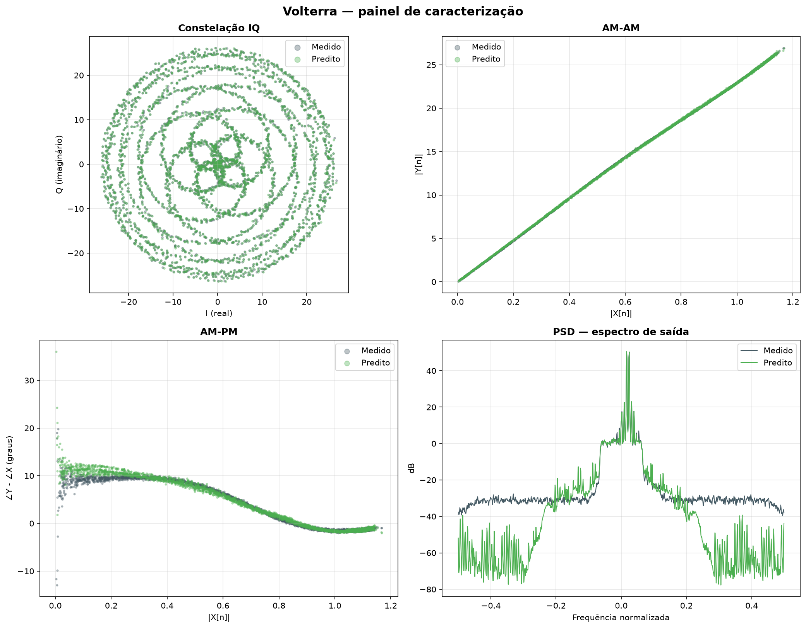

# Relatório de Caracterização de PA

*Gerado em 2026-08-13 03:26*  ·  fonte: `output/`

## 1. Comparação entre modelos

| Modelo | nº coef | RMSE | NMSE (dB) | EVM (%) | Ganho (dB) | Veredito EVM |
|---|---:|---:|---:|---:|---:|---|
| GeneralizedMemoryPolynomial | 246 | 0.0779 | -47.46 | 0.424 | 27.40 | EXCELENTE |
| MemoryPolynomial | 220 | 0.0970 | -45.56 | 0.527 | 27.40 | EXCELENTE |
| Volterra | 404 | 0.1310 | -42.95 | 0.712 | 27.40 | EXCELENTE |

**Melhor por RMSE:** GeneralizedMemoryPolynomial (RMSE = 0.0779, EVM = 0.424%, 246 coeficientes).

## Modelo: GeneralizedMemoryPolynomial

- **Hiperparâmetros:** `{'memory': 2, 'r_deg': 6, 'i_deg': 6, 'lag_depth': 2, 'lead_depth': 5, 'estimator_factory': "functools.partial(<class 'src.core.estimators.Ridge'>, lam=1e-06)"}`
- **Amostras (teste):** 9,668  ·  **PAPR da entrada:** 3.38 dB

### Métricas (padrão TELECOM)

| Métrica | Valor | Veredito |
|---|---:|---|
| RMSE | 0.07792 | — |
| NMSE | -47.46 dB | EXCELENTE |
| EVM | 0.424 % | EXCELENTE |
| Ganho médio | 27.40 dB | — |
| Planicidade de ganho (σ) | 0.251 dB | BOM |
| Planicidade de fase (σ) | 4.748 ° | A MELHORAR |

### Seleção de modelo (histórico do GridSearch)

O GridSearch avaliou **140625** combinações. Escolha por critério:

| Critério | nº coef | RMSE |
|---|---:|---:|
| RMSE | 1860 | 0.0688 |
| AIC | 534 | 0.0728 |
| BIC | 246 | 0.0814 |



### Equação do modelo (12 termos dominantes)

```
  (-139+687j) · xi[n-1]*|xi[n+3]|^5
  (+624.5+108.6j) · xr[n-1]*|xr[n+3]|^5
  (-498.8-218.1j) · xr[n-1]*|xr[n+4]|^4
  (-122.6-504.5j) · xr[n-0]*|xr[n-2]|^4
  (+181.9-474.3j) · xi[n-1]*|xi[n+4]|^4
  (+453.4-141.2j) · xi[n-0]*|xi[n-2]|^4
  (+115.2+460.6j) · xr[n-0]*|xr[n-2]|^2
  (+91.98-436.7j) · xi[n-0]*|xi[n+4]|^3
  (-437.9-79.86j) · xr[n-0]*|xr[n+4]|^3
  (-63.95+425.4j) · xi[n-1]*|xi[n+4]|^3
  (+423.6+66.57j) · xr[n-1]*|xr[n+4]|^3
  (-301.7-292j) · xr[n-0]*|xr[n+3]|^5
```



## Modelo: MemoryPolynomial

- **Hiperparâmetros:** `{'memory': 10, 'r_deg': 10, 'i_deg': 10}`
- **Amostras (teste):** 9,667  ·  **PAPR da entrada:** 3.38 dB

### Métricas (padrão TELECOM)

| Métrica | Valor | Veredito |
|---|---:|---|
| RMSE | 0.09696 | — |
| NMSE | -45.56 dB | EXCELENTE |
| EVM | 0.527 % | EXCELENTE |
| Ganho médio | 27.40 dB | — |
| Planicidade de ganho (σ) | 0.251 dB | BOM |
| Planicidade de fase (σ) | 4.748 ° | A MELHORAR |

### Seleção de modelo (histórico do GridSearch)

O GridSearch avaliou **2250** combinações. Escolha por critério:

| Critério | nº coef | RMSE |
|---|---:|---:|
| RMSE | 319 | 0.0948 |
| AIC | 297 | 0.0949 |
| BIC | 220 | 0.0984 |



### Equação do modelo (12 termos dominantes)

```
  (+1.509e+05+5.394e+04j) · xr[n-4]*|xr[n-4]|^6
  (+1.414e+05+6.758e+04j) · xr[n-6]*|xr[n-6]|^6
  (-5.495e+04+1.342e+05j) · xi[n-4]*|xi[n-4]|^6
  (-6.47e+04+1.197e+05j) · xi[n-6]*|xi[n-6]|^6
  (-1.258e+05-4.096e+04j) · xr[n-4]*|xr[n-4]|^7
  (-1.184e+05-5.397e+04j) · xr[n-6]*|xr[n-6]|^7
  (+4.398e+04-1.066e+05j) · xi[n-4]*|xi[n-4]|^7
  (+5.355e+04-9.496e+04j) · xi[n-6]*|xi[n-6]|^7
  (-7.995e+04-2e+04j) · xr[n-4]*|xr[n-4]|^5
  (-7.484e+04-3.276e+04j) · xr[n-6]*|xr[n-6]|^5
  (-5.77e+04-5.672e+04j) · xr[n-5]*|xr[n-5]|^6
  (+5.809e+04+4.516e+04j) · xr[n-5]*|xr[n-5]|^7
```



## Modelo: Volterra

- **Hiperparâmetros:** `{'memory': 2, 'order_r': 10, 'order_i': 7, 'estimator_factory': "functools.partial(<class 'src.core.estimators.Ridge'>, lam=1e-06)"}`
- **Amostras (teste):** 9,675  ·  **PAPR da entrada:** 3.38 dB

### Métricas (padrão TELECOM)

| Métrica | Valor | Veredito |
|---|---:|---|
| RMSE | 0.13103 | — |
| NMSE | -42.95 dB | EXCELENTE |
| EVM | 0.712 % | EXCELENTE |
| Ganho médio | 27.40 dB | — |
| Planicidade de ganho (σ) | 0.251 dB | BOM |
| Planicidade de fase (σ) | 4.748 ° | A MELHORAR |

### Seleção de modelo (histórico do GridSearch)

O GridSearch avaliou **100** combinações. Escolha por critério:

| Critério | nº coef | RMSE |
|---|---:|---:|
| RMSE | 5003 | 0.0838 |
| AIC | 404 | 0.1328 |
| BIC | 404 | 0.1328 |



### Equação do modelo (12 termos dominantes)

```
  (-1380-810j) · xr[n-0]*xr[n-0]*xr[n-0]*xr[n-0]*xr[n-0]*xr[n-0]*xr[n-2]
  (+611.1-1378j) · xr[n-0]*xr[n-2]*xr[n-2]*xr[n-2]*xr[n-2]*xr[n-2]*xr[n-2]
  (-1210+178.3j) · xi[n-1]*xi[n-2]*xi[n-2]
  (+1094-329.1j) · xi[n-0]*xi[n-1]*xi[n-2]
  (+279.4-1097j) · xi[n-0]*xi[n-0]*xi[n-0]*xi[n-0]*xi[n-0]*xi[n-0]*xi[n-2]
  (+828.7+602.1j) · xi[n-0]*xi[n-2]*xi[n-2]*xi[n-2]*xi[n-2]*xi[n-2]*xi[n-2]
  (-935.5+407j) · xi[n-0]*xi[n-0]*xi[n-1]
  (+926.2-344.4j) · xi[n-0]*xi[n-0]*xi[n-0]*xi[n-0]*xi[n-2]
  (-277.3-938.2j) · xr[n-0]*xr[n-1]*xr[n-2]
  (+68.24+936j) · xr[n-1]*xr[n-2]*xr[n-2]
  (+814+439.5j) · xr[n-0]*xr[n-0]*xr[n-0]*xr[n-0]*xr[n-0]*xr[n-0]*xr[n-0]
  (-290.4-750j) · xr[n-0]*xr[n-0]*xr[n-0]*xr[n-0]*xr[n-2]
```


